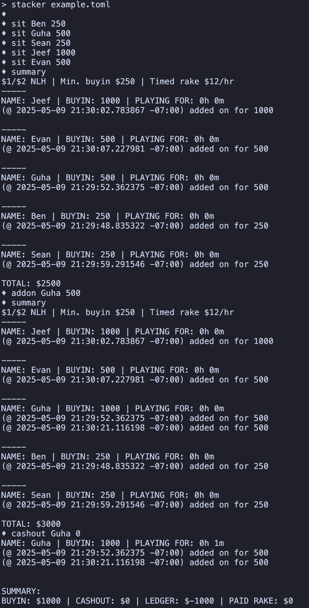

# Stacker

**Stacker** is a REPL for managing a home-game poker ledger.

## Usage

Stacker expects game details in a `.toml` table, which
- must include `sb` and `bb`,
- optionally supports `min_bi` (inclusive minimum buyin) and `max_bi` (inclusive maximum buyin),
- optionally supports `rake` (timed rake/hr).

See `example.toml` for a valid config file describing a $1/$2, $250 min-buyin, no max-buyin, $12/hr timed rake game.

Type `stacker <config.toml>` into your terminal to launch the REPL. Currently, stacker supports
- `sit <player> <buyin>` / `host <player> <buyin>`: adding a new player with initial buyin. If `host` is used, the player is not subject to rake;
- `addon <player> <amount>`: adding to the player's buyin;
- `check <player>`: view individual players' states without removing them;
- `rem <player> <stack>` / `cashout <player> <stack>`: cashout players, showing buy-in, cash-out, net ledger, and rake paid. If `cashout` is used, the output is more verbose;
- `total`: displays the sum of all buyins (total amount of money on the table);
- `summary` / `end`: displays a comprehensive summary of the game/players thus far. If `end` is used, the REPL also quits.

Stacker is built with [easy_repl](https://crates.io/crates/easy_repl). 

## Example



## Installation

### From source

Stacker requires `cargo`. On Mac: `brew install cargo`. On Linux: `sudo apt-get install cargo`.

```sh
git clone https://github.com/bensong04/stacker.git
cd stacker

make
sudo make install
```
